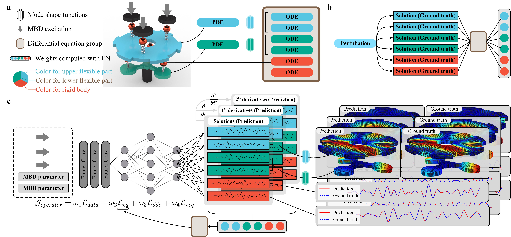

# PINO-MBD

**Solving practical multi-body dynamics problems using a single neural operator**

Abstract: *As a fundamental design tool in many engineering disciplines, multi-body dynamics (MBD) models a complex structure with a differential equation group containing multiple physical quantities. Engineers must yconstantly adjust structures at the design stage, which requires a highly efficient solver. The rise of deep learning technologies has offered new perspectives on MBD. Unfortunately, existing black-box models suffer from poor accuracy and robustness, while the advanced methodologies of single-output operator regression cannot deal with multiple quantities in MBD. To address these challanges, we propose PINO-MBD, a deep learning framework for solving practical MBD problems based on the theory of physics-informed neural operator (PINO). PINO-MBD uses a single network for all quantities in a multi-body system, instead of training dozens, or even hundreds of networks as in the existing literature. We demonstrate the flexibility and feasibility of PINO-MBD for one toy example and two practical applications: vehicle-track coupled dynamics (VTCD) and reliability analysis of a four-storey building. The performance of VTCD indicates that our framework outperforms existing software and machine learning-based methods in terms of efficiency and precision, respectively. For the g reliability analysis, PINO-MBD can provide higher-resolution results in less than a quarter of the time incurred when using the probability density evolution method (PDEM). This framework integrates mechanics and deep learning technologies, and may reveal a new concept for MBD and probabilistic engineering.*
## Requirements
- Pytorch 1.8.0 or later
- wandb
- tqdm
- scipy
- h5py
- numpy
- Matlab R2016b or later

## Data description
### The toy example
- Train set: `5000V3.mat`
- Test set: `500V3.mat`
- Virtual dataset: `VirtualData_8000_V3.mat`
- Weights with EN: `Weights_Medium_5000_V3.mat`
- Weights without EN: `Weights_PINO.mat`
- Weights for the test set: `Weights_Medium_500_V3.mat`
- Weights for the virtual dataset: `Weights_Virtual_V3.mat`
- Structure information (including mode shape functions): `StructureInfo.mat`

### Vehicle-track coupled dynamics (VTCD)
- Train set: `10000V2.mat`
- Test set: `2000V2.mat`
- Virtual dataset: `VirtualData_10000V2.mat`
- Weights with EN: `Weights_10000V2.mat`
- Weights without EN: `Weights_PINO_10000V2.mat`
- Weights for the test set: `Weights_2000V2.mat`
- Weights for the virtual dataset: `Weights_Virtual.mat`

### Reliability assessment for a 4-storey building
- Train set: `150.mat`
- Test set: `30.mat`
- Virtual dataset: `VirtualData_1500.mat`
- Weights with EN: `Weights_Medium_150.mat`
- Weights without EN: `Weights_PINO_150.mat`
- Weights for the test set: `Weights_Medium_30.mat`
- Weights for the virtual dataset: `Weights_Virtual.mat`

